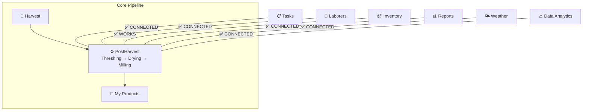
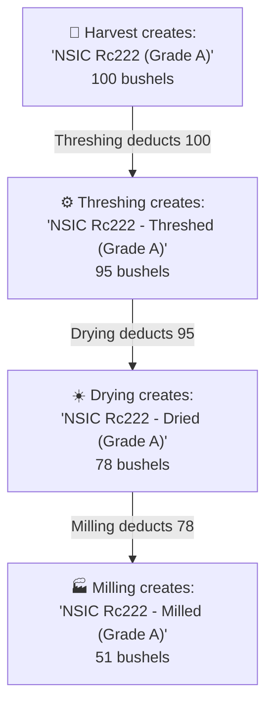

# PostHarvest Module — Workflow & Connection Audit

## Core Pipeline: Harvest → Processing → My Products

The intended workflow is a **linear pipeline**:

The satellite modules connect **around** this pipeline:

---

## A. Core Pipeline Issues

### 1. 🌾 Harvest → PostHarvest: Unit must default to "bushels"

> [!WARNING]
> **Harvest unit defaults to `kg` instead of `bushels`.**

| File | Issue |
|------|-------|
| [HarvestFormModal.vue](file:///home/hanyu/Projects/farm_operation_management/resources/js/Pages/Farmer/Harvests/HarvestFormModal.vue#L446) | `unit: props.harvest?.unit \|\| 'kg'` — defaults to `kg`, should be `bushels` |
| [ProcessForm.vue](file:///home/hanyu/Projects/farm_operation_management/resources/js/Pages/Farm/PostHarvest/ProcessForm.vue#L54-L58) | Input unit dropdown has `kg`, `sacks`, `tons`, `bags` — **missing `bushels`** |
| [ProcessForm.vue](file:///home/hanyu/Projects/farm_operation_management/resources/js/Pages/Farm/PostHarvest/ProcessForm.vue#L229) | `input_unit: 'kg'` default — should be `bushels` |
| [ProcessForm.vue](file:///home/hanyu/Projects/farm_operation_management/resources/js/Pages/Farm/PostHarvest/ProcessForm.vue#L83-L85) | Output unit dropdown has only `kg` and `sacks` — **missing `bushels`** |

**Fix needed:**
- HarvestFormModal: Change default unit from `'kg'` to `'bushels'`
- ProcessForm input dropdown: Add `bushels` option and make it default
- ProcessForm output dropdown: Add `bushels` option
- ProcessForm default form: Change `input_unit` and `output_unit` to `'bushels'`

---

### 2. ⚙️ PostHarvest Processing Pipeline — Inventory Transformation Chain

Each processing step **does transform inventory** — it deducts from the source item and creates a new, distinctly-named inventory product. Here's the exact trace:

#### Step-by-step inventory chain

#### How it works in code

| Step | Source inventory item | Output inventory item | Code |
|------|----------------------|----------------------|------|
| **Harvest** | _(creates new)_ | `"NSIC Rc222 (Grade A)"` | [HarvestController::addHarvestToInventory()](file:///home/hanyu/Projects/farm_operation_management/app/Http/Controllers/Farm/HarvestController.php#L230-L278) |
| **Threshing** | deducts from `"NSIC Rc222 (Grade A)"` | creates `"NSIC Rc222 - Threshed (Grade A)"` | [PostHarvestService::transformInventory()](file:///home/hanyu/Projects/farm_operation_management/app/Services/PostHarvestService.php#L141-L228) |
| **Drying** | deducts from `"NSIC Rc222 - Threshed (Grade A)"` | creates `"NSIC Rc222 - Dried (Grade A)"` | Same method, using parent output as source |
| **Milling** | deducts from `"NSIC Rc222 - Dried (Grade A)"` | creates `"NSIC Rc222 - Milled (Grade A)"` | Same method, using parent output as source |

#### Chain resolution logic

- [resolveSourceInventoryName()](file:///home/hanyu/Projects/farm_operation_management/app/Services/PostHarvestService.php#L234-L250): If process has a `parent_process_id`, source = parent's output name. Otherwise source = raw harvest name.
- [buildOutputInventoryName()](file:///home/hanyu/Projects/farm_operation_management/app/Services/PostHarvestService.php#L255-L271): Appends `" - Threshed"`, `" - Dried"`, or `" - Milled"` suffix.
- Each step creates `InventoryTransaction` records (both `out` from source and `in` to output) with `reference_type: PostHarvestProcess`.

#### ✅ What works

| Aspect | Status |
|--------|--------|
| Inventory name chaining (source → output) | ✅ Works correctly |
| Stock deduction from source | ✅ Works with transaction audit trail |
| New inventory item creation for output | ✅ Auto-created with `firstOrCreate` |
| Parent-child process linking | ✅ Works — output feeds next step's input |
| Weight loss calculation | ✅ Calculated on completion |
| Cost tracking per step | ✅ Self/fixed/per-unit cost types |
| Expense recording per step | ✅ Creates `Expense` with category `processing` |

#### ❌ Issues with the chain

| Issue | Details |
|-------|--------|
| **`bushels` not in ProcessForm dropdown** | Input unit dropdown has `kg`, `sacks`, `tons`, `bags` — no `bushels`. So even though harvest stores bushels, the processing form forces a different unit. |
| **Default unit is `kg`** | ProcessForm defaults `input_unit: 'kg'` and `output_unit: 'kg'` instead of carrying forward the harvest's unit (bushels). |
| **Unit mismatch between harvest and processing** | Harvest stores `bushels` but processing defaults to `kg`. The backend `createProcess()` only falls back to harvest unit if `input_unit` is null — but the frontend always sends `'kg'` as default. |
| **Output unit has only 2 options** | Output dropdown (line 83-85) only has `kg` and `sacks` — missing `bushels`, `tons`, `bags`. |

---

### 3. 🛒 PostHarvest → My Products (Marketplace)

| Aspect | Status | Details |
|--------|--------|---------|
| "Publish to Marketplace" button | ✅ Exists | On PostHarvest Index, navigates with `harvest_id` |
| Harvest linking in Product Create | ✅ Works | Marketplace Create page has harvest dropdown |
| Post-harvest summary fetch | ✅ Works | `loadProcessingSummary()` fetches processing data when harvest selected |
| Auto-fill quantity from output | ✅ Works | Uses `final_quantity` from processing summary |
| Auto-fill product name | ✅ Works | Auto-generates "Variety Milled Rice" for milling |
| Processing method label | ✅ Works | Auto-sets `processing_method = 'milled'` when last step is milling |
| "View Processing" link | ✅ Works | Links back to processing pipeline page |

> [!TIP]
> This connection is actually **better than initially reported**. The Marketplace Create page fetches post-harvest data and auto-fills details. However, it doesn't account for the `bushels` unit fix — once harvest defaults to bushels, this auto-fill chain should propagate correctly.

**Minor gap:** The `processing_method` dropdown has: `milled`, `brown`, `parboiled`, `organic` — but no `threshed` or `dried` options for products sold at intermediate stages.

---

## B. Satellite Module Connections

### 4. 📦 Inventory — ✅ CONNECTED

| Aspect | Status |
|--------|--------|
| Deduct input from source inventory | ✅ Works |
| Add output to new/named inventory item | ✅ Works |
| Transaction audit trail | ✅ Works |
| Auto-naming (e.g., "NSIC Rc222 - Milled") | ✅ Works |

**This is working well.** No issues found.

---

### 5. 📋 Tasks — ✅ CONNECTED

| Aspect | Status | Details |
|--------|--------|---------|
| DB relationship exists | ✅ | `PostHarvestProcess::task()` belongsTo — `task_id` in schema |
| Task types defined | ✅ | `TYPE_THRESHING`, `TYPE_DRYING`, `TYPE_MILLING` constants exist |
| **"Assign Laborers" checkbox** | ✅ Connected | ProcessForm sets assign_laborers flag to backend |
| **Auto-task creation** | ✅ Works | Starting a process automatically creates a Task with `field_id` |
| **Task↔Process sync** | ✅ Works | Bi-directional sync in PostHarvestService and TaskController |
| **Pre-Planting Support** | ✅ Works | "Land Preparation" etc. can be created using `field_id` only |

> [!CAUTION]
> The "Assign Laborers" checkbox in ProcessForm.vue is **completely non-functional**. The `assignLaborers` ref (line 220) is never included in the `saveProcess()` API call (line 289-309). Users see the checkbox, think labor tracking works, but nothing happens.

---

### 6. 👷 Laborers — ✅ CONNECTED

| Aspect | Status |
|--------|--------|
| Laborer assignment to post-harvest | ✅ Works |
| LaborWage records for post-harvest work | ✅ Works |
| Laborer model has no PostHarvest relationship | ✅ Added |
| Labor cost tracking for threshing/drying/milling | ✅ Works |

Post-harvest work (which often involves hired laborers) is completely untracked in the Laborers module. Worker hours and wages for processing are invisible.

---

### 7. 📊 Reports — ✅ CONNECTED

| Aspect | Status |
|--------|--------|
| ReportService imports PostHarvestProcess | ✅ Yes |
| Dashboard shows processing metrics | ✅ Yes |
| Production summary distinguishes raw vs. processed | ✅ Yes |
| Post-harvest completions in recent activities | ✅ Yes |
| Processing costs in financial summary | ✅ Yes |
| Seasonal analysis includes processing data | ✅ Yes |

> [!WARNING]
> **FinancialService** also has **zero references** to PostHarvest or processing expenses. Even though `PostHarvestService::createProcessingExpense()` correctly creates `Expense` records with `category = 'processing'`, the FinancialService **never queries for this category**. Processing costs are invisible in profit/loss reports.

---

### 8. 🌤️ Weather — ✅ CONNECTED

| Aspect | Status |
|--------|--------|
| Drying weather advisory | ✅ Added |
| Rain warnings affecting processing schedule | ✅ Added |
| WeatherService references PostHarvest | ✅ Yes |
| WeatherAnalyticsService references PostHarvest | ✅ Yes |

Drying is heavily weather-dependent in Philippine rice farming. Farmers need advice on optimal drying days (low humidity, no rain forecast).

---

### 9. 📈 Data Analytics — ✅ CONNECTED

| Aspect | Status |
|--------|--------|
| RiceProductionAnalyticsService references PostHarvest | ✅ Yes |
| PostHarvestService has efficiency data | ✅ Yes |
| Historical recovery rate trends | ✅ Added |
| Cost optimization analysis (self vs. provider) | ✅ Added |
| Per-variety processing performance | ✅ Added |
| **Frontend Visualization** | ✅ Added | Post-Harvest section in RiceFarmingAnalytics.vue |

The `PostHarvestService::getPostHarvestEfficiency()` method exists but is only consumed internally via the API — it's not integrated into the broader analytics platform.

---

## Summary of All Gaps

### Core Pipeline Fixes
| # | Issue | File(s) | Severity | Status |
|---|-------|---------|----------|--------|
| 1 | Harvest unit default should be `bushels` not `kg` | HarvestFormModal.vue | 🔴 Must fix | ✅ Fixed |
| 2 | PostHarvest ProcessForm missing `bushels` in input dropdown | ProcessForm.vue | 🔴 Must fix | ✅ Fixed |
| 3 | PostHarvest ProcessForm missing `bushels` in output dropdown | ProcessForm.vue | 🔴 Must fix | ✅ Fixed |
| 4 | PostHarvest ProcessForm default `input_unit` should be `bushels` | ProcessForm.vue | 🔴 Must fix | ✅ Fixed |
| 5 | Marketplace missing `threshed`/`dried` processing method options | Create.vue | 🟡 Nice to have | ✅ Fixed |

### Satellite Module Gaps
| # | Issue | Severity | Status |
|---|-------|----------|--------|
| 6 | "Assign Laborers" checkbox is dead UI — never sent to backend | 🔴 User-facing bug | ✅ Fixed |
| 7 | No auto-Task creation when starting a process | 🔴 Missing feature | ✅ Fixed |
| 8 | No Task↔Process status sync | 🟡 Missing feature | ✅ Fixed |
| 9 | Laborers module has zero PostHarvest integration | 🟡 Missing feature | ✅ Fixed |
| 10 | ReportService ignores all PostHarvest data | 🔴 Data gap | ✅ Fixed |
| 11 | FinancialService ignores processing expenses | 🔴 Profits overstated | ✅ Fixed |
| 12 | Weather has no drying advisories | 🟠 Missing feature | ✅ Fixed |
| 13 | Analytics doesn't use PostHarvest efficiency data | 🟡 Missing feature | ✅ Fixed |
